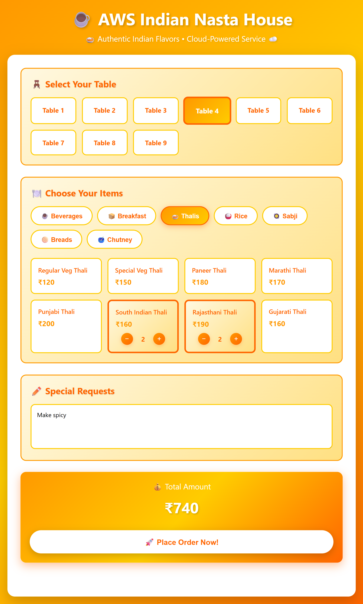
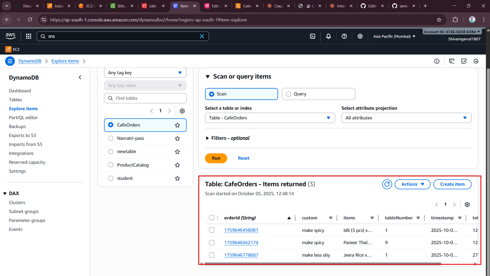
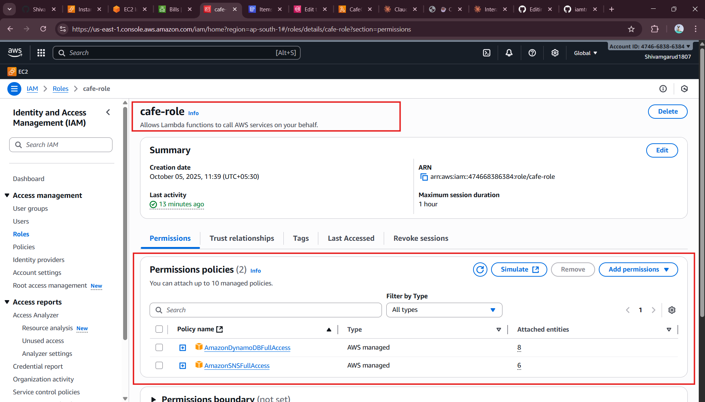
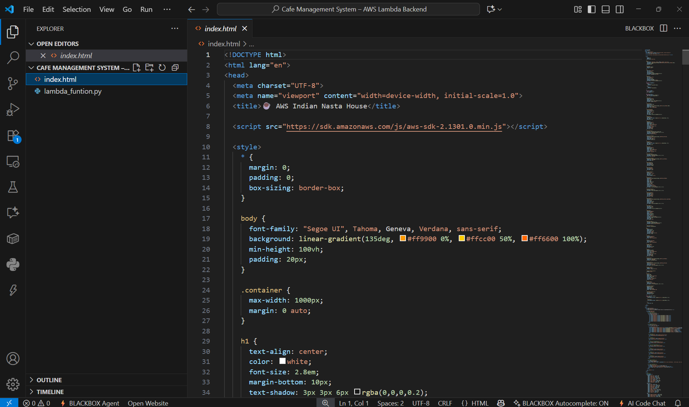
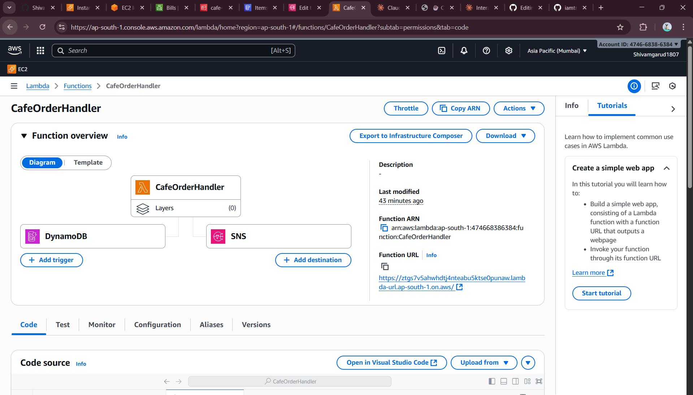
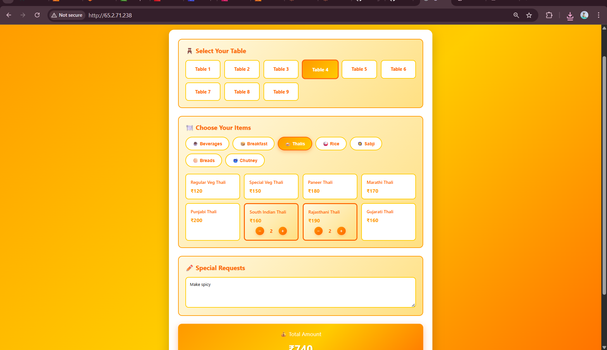

# ☕ Cafe Management System – AWS Lambda Backend

---

## 🚀 Project Overview
A **serverless backend system** to manage cafe orders in real-time.  
Users place orders via a frontend, orders are saved in **DynamoDB**, and chefs receive **SMS notifications instantly via SNS**.  

Key features:
- Place orders with table number, items, and customizations.
- Orders stored securely in DynamoDB.
- Real-time SMS notifications to chefs via SNS.
- Fully **serverless architecture** using AWS Lambda and IAM roles.

---

## 🛠️ Tech Stack & Services

| Service        | Purpose                                      |
| -------------- | -------------------------------------------- |
| **AWS Lambda** | Backend order handler                        |
| **DynamoDB**   | Stores all order records                     |
| **SNS**        | Sends SMS notifications to chefs             |
| **IAM Roles**  | Grants Lambda permissions for DynamoDB & SNS |
| **API Gateway**| Triggers Lambda from frontend HTTP requests |

---

## 📦 Data Structure (DynamoDB)

| Attribute   | Type   | Description              |
| ----------- | ------ | ------------------------ |
| orderId     | String | Unique ID for each order |
| tableNumber | String | Table number             |
| items       | String | Items ordered            |
| custom      | String | Customizations           |
| total       | Number | Order total              |
| timestamp   | String | ISO timestamp of order   |

---

## 🔧 Environment Variables

| Variable Name   | Description                          |
| --------------- | ------------------------------------ |
| `DYNAMO_TABLE`  | DynamoDB table name (`CafeOrders`)   |
| `SNS_TOPIC_ARN` | SNS topic ARN for chef notifications |

---

## 📱 SNS Configuration
- **Topic Name:** `sns-for-sms`
- **Message Example:**
- 🍽️ New Order #1234 - Table 5
Items: Masala Dosa x2, Soda x1
Custom: Extra Spicy
Amount: ₹150

---

## 🔐 IAM Roles & Policies
**Role Name Suggestion:** `CafeOrdersLambdaRole`  

**Required Policies:**  
- `AmazonDynamoDBFullAccess` (or least privilege: PutItem on CafeOrders)  
- `AmazonSNSFullAccess` (or least privilege: Publish to SNS)  
- `AWSLambdaBasicExecutionRole`

---

## 🌐 Lambda Trigger Setup
1. Create **API Gateway HTTP API**.
2. Add a **POST method** pointing to the Lambda function.
3. Enable **CORS** for frontend requests.
4. Lambda processes the order and sends SNS notifications.

**🗂️ Folder Structure**

cafe-management-system/
│
├─ lambda/
│   └─ cafe_order_lambda.py
├─ frontend/
│   └─ index.html
└─ README.md

🌟 Contributors
- **Trupti Mane Ma’am** – ⭐ AWS wizard & hands-on support, made testing and deployment seamless! [iamtruptimane](https://github.com/iamtruptimane)
- **Shivam Garud** – DevOps & Cloud Engineer
  
**- 🔗 Links & Contact**

GitHub: [shivamgarud8](https://github.com/shivamgarud8)  
LinkedIn: [Shivam Garud](https://www.linkedin.com/in/shivam-garud-371b5a307)

